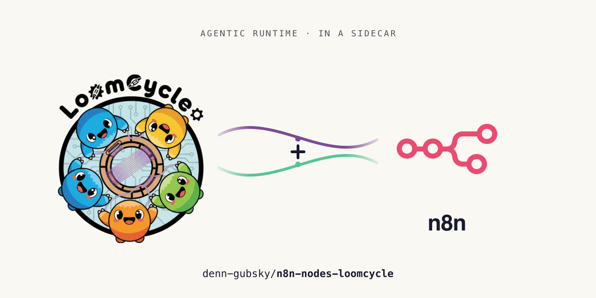

<p align="center">
  
</p>

# n8n-nodes-loomcycle-full

Community n8n nodes for the [loomcycle](https://github.com/denn-gubsky/loomcycle) agentic runtime — design and operate loomcycle agents directly from n8n's visual builder.

[](https://www.npmjs.com/package/@loomcycle/n8n-nodes-loomcycle-full)
[](LICENSE)

> ## 📦 Which package do I want?
> This is **`@loomcycle/n8n-nodes-loomcycle-full`** — the **full self-hosted edition** (20 nodes), including the langchain-based **AI-Agent Tool sub-nodes** (Memory / Channel / Sub-Agent / MCP Server Tool), **SSE-push** triggers, and the Run **Wait for Completion** op.
> - **It is NOT n8n-Cloud-verified** and won't pass n8n's community-node scanner (it depends on `@langchain/core` and uses timers/SSE, which Cloud disallows). **Install it manually on self-hosted n8n.**
> - If you're on **n8n Cloud** or want the verified node, use the slim **[`@loomcycle/n8n-nodes-loomcycle`](https://www.npmjs.com/package/@loomcycle/n8n-nodes-loomcycle)** (14 nodes; zero deps; poll-based triggers; Chat Model on `@n8n/ai-node-sdk`).
> - Both are built from this repo: the slim package from `main`, this full edition from the long-lived [`full-edition`](https://github.com/denn-gubsky/n8n-nodes-loomcycle/tree/full-edition) branch.

This package realises **Phase 2 / Vector 3** of the [loomcycle ↔ n8n integration RFC](https://github.com/denn-gubsky/loomcycle-internal/blob/main/doc-internal/rfcs/n8n-comparison.md): custom n8n nodes that let operators drive loomcycle from the n8n canvas, while loomcycle stays the agentic runtime substrate.

## Requirements

These nodes are a thin n8n-shaped wrapper over loomcycle's wire API — they **call your loomcycle deployment**, they don't run an agent runtime inside n8n. So you need:

- **A reachable loomcycle deployment + a bearer token** (loomcycle's `LOOMCYCLE_AUTH_TOKEN`). Every node call goes out to the Base URL on the **LoomCycle API** credential.
  - **Self-hosted n8n:** loomcycle can sit on `localhost` / your LAN (e.g. `http://127.0.0.1:8787`).
  - **n8n Cloud:** loomcycle must be reachable from the public internet — a public HTTPS URL or a tunnel (Cloudflare Tunnel, ngrok, …) — because n8n Cloud makes the outbound call from its own network, not yours.
- **loomcycle ≥ v0.9.2** for the substrate-admin ops (AgentDef / SkillDef / MCP Server); **≥ v0.12.x** for the Schedule node and per-tool credentials. Basic Run / Memory / Channel ops work on older builds.
- **n8n ≥ 1.82** (the package targets `n8n-workflow` ≥ 1.82).

## Quick install

```bash
# Self-hosted n8n → Settings → Community Nodes → Install:
@loomcycle/n8n-nodes-loomcycle-full
```

Once installed, configure the **LoomCycle API** credential with your loomcycle deployment's bearer token + base URL.

The package lives under the [`@loomcycle`](https://www.npmjs.com/org/loomcycle) npm org alongside [`@loomcycle/client`](https://www.npmjs.com/package/@loomcycle/client) — same trust boundary, same maintainer.

## What's in the box

Twenty nodes (12 action + 3 trigger + 5 cluster sub-nodes) plus one credential type.

### Credential

- **LoomCycle API** — bearer token + base URL + optional Default User ID / User Tier / MCP URL. The credential test calls `GET /v1/_me` (whoami) to validate the bearer resolves to a principal (tenant + scopes) — requires loomcycle ≥ v0.17. Under v0.17's multi-tenant authorization (RFC L), the bearer is a tenant-scoped `OperatorTokenDef` token; provision it with the scopes your workflow's operations need.

### Action nodes

As of **2.0.0** the former single multi-resource umbrella node is split into **dedicated action nodes**, each with its own canvas icon (n8n renders one icon per node type — separate nodes are the only way to give each entity a distinct glyph). They all share one credential and one wire client; they are drag-and-drop separate in the node picker.

- **LoomCycle Run** — `Spawn` / `Spawn Batch` / `Get Status` / `Get Transcript` / `Compact` / `Wait for Completion` / `Cancel` / `List Agents`. Spawn-time **Sampling** / **Compaction** / **Run Timeout** overrides live under *Additional Fields*. `Spawn Batch` fans out up to 32 runs (loomcycle ≥ v0.33); `Compact` summarises a parked run's context (≥ v0.33). The full edition keeps the in-node **Wait for Completion** op (SSE-backed).
- **LoomCycle Memory** — `Get Entry` / `List Entries` / `List Scope IDs` / `List Scopes` / `Set Entry` / `Delete Entry` (full CRUD; per-tool credentials `userCredentials` map on Spawn require loomcycle ≥ v0.12.x)
- **LoomCycle Channel** — `Publish` / `Subscribe` / `Peek` / `Ack` / `Await` / `Broadcast` / `List Channels` / `Create Channel` / `Update Channel` / `Delete Channel` / `Purge Channel`. `Await` (fan-in) waits on a predicate across channels and `Broadcast` (fan-out) publishes to many atomically (loomcycle ≥ v0.25); yaml-declared channels remain immutable (but `Purge` is allowed on them).
- **LoomCycle Agent Definition** — `Create` / `Fork` / `Get` / `List Versions` / `Promote` / `Retire` / `Verify` (content_sha256 round-trip). Create/Fork expose a **Provider** dropdown (folded into the overlay); selecting **Code-JS** authors a [deterministic JavaScript agent](#code-js-agents) (RFC J).
- **LoomCycle Skill Definition** — same 7 ops as AgentDef, applied to skills
- **LoomCycle MCP Server** — `Register` / `Fork` / `Promote` / `Retire` / `Get` / `List Versions` / `Rediscover` / `Verify` — dynamic MCP server registration (requires loomcycle ≥ v0.9.2)
- **LoomCycle Schedule** — `Create` / `Fork` / `Get` / `List Versions` / `Retire` — substrate-native scheduled runs (RFC E; requires loomcycle ≥ v0.12.x). Fired runs land on the **Run Completed** trigger.
- **LoomCycle Hook** — `Register` / `List` / `Delete` — **outbound** pre/post-tool webhook callbacks; point the callback URL at an n8n **Webhook** trigger to call back into a workflow on matched tool calls.
- **LoomCycle Webhook** — `Create` / `Fork` / `Get` / `List Versions` / `Retire` — **inbound** webhook endpoints (RFC H; requires loomcycle ≥ v0.14.x): an external POST to a loomcycle-hosted endpoint spawns an agent run / publishes to a channel. (Distinct from **Hook** above, which is outbound.)
- **LoomCycle A2A Agent** — `Create` / `Fork` / `Get` / `List Versions` / `Retire` — register **external** A2A (Agent2Agent) agents loomcycle can call as tools (RFC G; requires loomcycle ≥ v0.14.x).
- **LoomCycle A2A Server Card** — `Create` / `Fork` / `Get` / `List Versions` / `Retire` — manage the agent card loomcycle **publishes** to expose its own agents to external A2A clients (RFC G; requires loomcycle ≥ v0.14.x).
- **LoomCycle Interruption** — `List for User` / `List for Run` / `Resolve` — [human-in-the-loop](#human-in-the-loop) over `Interruption.ask`: list pending agent questions and post a human's answer back to unblock the parked run (requires loomcycle's consumer-MCP interruption backend).

> **Migration from 1.x:** the umbrella `LoomCycle` node (type `loomCycle`) was removed. Workflows built on 1.x must swap each `LoomCycle` node for the matching dedicated node (e.g. a `LoomCycle` node with Resource = Memory → **LoomCycle Memory**); operations and parameters are otherwise unchanged.

### Trigger nodes

- **LoomCycle: Run Completed** — fires when an agent run reaches a terminal state. SSE primary with polling fallback for proxy-hostile deployments. Honours `parentAgentId` + `debug` filters from the adapter.
- **LoomCycle: Channel Message** — long-poll subscribe with two delivery modes: `auto-ack` (at-most-once) and `peek + explicit ack` (at-least-once, cursor persisted in workflow static data).
- **LoomCycle: Interrupt Pending** — poll-based: fires on new **pending interruptions** (agent questions) for a user, deduping by `interrupt_id`. Wire the output to a human channel (Slack / email / form) and feed the answer back via **LoomCycle Interruption → Resolve**.

### Cluster sub-nodes (plug into n8n's AI Agent)

- **LoomCycle Chat Model** — plugs into the AI Agent's **Chat Model** slot. Routes the agent's LLM calls through loomcycle's gateway (`POST /v1/_llm/chat`) instead of a direct provider SDK. Single credential covers all providers; loomcycle's resolver picks provider / model at request time; per-user quota tracking; single audit log. Supports tool calling (LangChain `bindTools` → gateway's provider-agnostic schema → substrate translates per-provider). **No agent loop** — this is the thin gateway shim, not the full runtime. Use **Sub-Agent Tool** below when you want the agent loop.
- **LoomCycle Memory Tool** — exposes Memory CRUD (read + write) as a single discriminated tool the AI Agent can call. The agent can persist intermediate state between reasoning turns or across runs via `setEntry` / `deleteEntry`.
- **LoomCycle Channel Tool** — Channel publish + peek as agent tools.
- **LoomCycle Sub-Agent Tool** — delegates to a configured loomcycle agent (drains `runStreaming`); the agent receives the parent's tool-call prompt and returns its `finalText`.
- **LoomCycle MCP Server Tool** — **strategic differentiator.** Drag onto a canvas → the substrate auto-registers the MCP server via `MCPServerDef` (idempotent ensure: `get` → `create` on `NotFoundError`) → returns a tool that spawns a loomcycle agent with `allowed_tools: ['mcp__<name>__*']`. `cleanupOnEnd: false` default — registrations persist across executions for stable agentic teams.

## Configure the credential

In n8n, navigate to **Settings → Credentials → New** and pick **LoomCycle API**.

| Field | Required | Notes |
|---|---|---|
| Base URL | yes | e.g. `http://127.0.0.1:8787` |
| Bearer Token | yes | Matches loomcycle's `LOOMCYCLE_AUTH_TOKEN` env var |
| Default User ID | no | Falls through to any node where `userId` is left empty |
| Default User Tier | no | Same fall-through |
| MCP URL (optional) | no | Only needed if you reference loomcycle's MCP server from n8n's MCP Client Tool sub-node (Vector 1) |

Click **Test** → a green checkmark means the bearer authenticated. Behind the scenes: `GET /v1/_me` with `Authorization: Bearer <token>` — this resolves the token's principal (tenant + scopes), so an invalid / expired / wrong-tenant token fails the test here rather than at runtime. (Requires loomcycle ≥ v0.17.)

## Examples

Six importable workflow JSONs in [`examples/`](examples/) cover the canonical patterns:

| # | File | Pattern |
|---|---|---|
| 01 | [`01-multi-agent-research.json`](examples/01-multi-agent-research.json) | Researcher → summariser → channel digest |
| 02 | [`02-slack-loomcycle-slack.json`](examples/02-slack-loomcycle-slack.json) | Slack trigger → loomcycle agent → Slack reply |
| 03 | [`03-daily-activity-report.json`](examples/03-daily-activity-report.json) | Cron → `listAgents` → JS aggregation → email |
| 04 | [`04-n8n-as-loomcycle-tool.json`](examples/04-n8n-as-loomcycle-tool.json) | **Vector 2** — n8n workflow as MCP server consumed by loomcycle |
| 05 | [`05-ai-agent-with-loomcycle-memory.json`](examples/05-ai-agent-with-loomcycle-memory.json) | n8n AI Agent + Memory + Sub-Agent cluster tools |
| 06 | [`06-dynamic-mcp-provisioning.json`](examples/06-dynamic-mcp-provisioning.json) | **Crown jewel** — `LoomCycleMcpServerTool` auto-provisioning |

Import via **Workflows → Import from File**, then attach your LoomCycle API credential. See [`examples/README.md`](examples/README.md) for per-example prerequisites + caveats.

## Provisioning MCP servers dynamically

The `LoomCycleMcpServerTool` cluster sub-node is the package's signature feature. When the parent AI Agent invokes it:

1. **On first run:** calls `mcpServerDef({op: 'get', name})` → on `NotFoundError`, calls `mcpServerDef({op: 'create', name, transport, url, headers, promote: true})`. The substrate registers the MCP server; subsequent agent spawns can reference it as `mcp__<name>__*`. (On loomcycle ≥ v0.20 a re-register of identical content is a server-side no-op — `deduplicated: true` — so the get-first step is an optimisation, not a correctness requirement.)
2. **On subsequent runs:** the `get` succeeds; `create` is skipped. Idempotent.
3. **On invocation:** spawns the configured loomcycle agent with `allowed_tools: ['mcp__<name>__*']`. The agent has access to the MCP server's tool surface for the duration of the run.

The same registration is also available explicitly via the **LoomCycle MCP Server** action node (Register / Fork / Promote / Retire / Get / List / Rediscover / Verify) when you want to provision ahead of any Run nodes rather than lazily on first agent invocation.

**Tool auto-discovery (loomcycle ≥ v0.20).** Register/Fork run the MCP `tools/list` handshake at registration and return a `discovered` count in the node output — you see the tool surface immediately instead of waiting for first call. It's best-effort: an unreachable peer still registers and self-heals lazily. Untick **Discover Tools at Registration** (action node) to register connection metadata only.

**Two create-time checks to know about (v0.20):** the URL host is validated against the allowlist *at registration* (a loopback / RFC1918 callback host must be in the **private** host allowlist, not just the general one), and inner `${LOOMCYCLE_*}` header tokens are **expanded at registration** — so those env vars must exist on the deployment before you Register, or the discovery handshake authenticates with an unresolved token.

### The env-var mirror

The Headers field accepts **template strings** (not plaintext credentials):

```
Authorization: Bearer ${LOOMCYCLE_SLACK_TOKEN}
```

At request time, loomcycle substitutes `${LOOMCYCLE_*}` tokens from its own environment. **The operator must mirror the credential**: it lives in n8n (for n8n's own Slack credential, if any) AND in loomcycle's env (`LOOMCYCLE_SLACK_TOKEN=…`). Plaintext credentials never traverse the n8n → loomcycle wire.

The cluster sub-node logs the detected env-var names so you can see them in n8n's execution log:

```
[LoomCycleMcpServerTool] MCP server slack-mcp registered. Required env vars on loomcycle: LOOMCYCLE_SLACK_TOKEN
```

## Code-JS agents

[code-js](https://github.com/denn-gubsky/loomcycle) (RFC J) is a loomcycle **synthetic provider**: the agent runs deterministic JavaScript instead of an LLM — replayable, no model cost. A code-js agent is just an Agent Definition with `provider: code-js` (and no model), spawned through the normal **LoomCycle Run** → **Run Completed** lifecycle. No dedicated node is needed.

**Author it inline from n8n** (loomcycle ≥ **v0.20**): on **LoomCycle Agent Definition → Create** (or **Fork**), pick **Code-JS** in the Provider dropdown and write the source in the **JavaScript Code** editor that appears. The node folds it into the overlay as `code_body`; loomcycle compiles + content-hashes it at registration. No host filesystem access needed — the code travels the wire like any other definition field.

One host prerequisite: enable the provider with `LOOMCYCLE_CODE_AGENTS_ENABLED=1` (default off — operator-trust, same posture as the Bash tool; or registration is refused). Inline source is capped at ~256 KB. For reproducible runs, optionally `LOOMCYCLE_CODE_AGENTS_DETERMINISTIC=1`.

> **Filesystem fallback (still supported):** leave the JavaScript Code editor empty and loomcycle falls back to `agent_code/<name>/index.js` (under `LOOMCYCLE_CODE_AGENTS_ROOT`) on the host, where `<name>` matches the Agent Definition name. Inline `code_body` wins when both are present.

## Passing metadata to agents

loomcycle ≥ **v0.21** adds a **non-secret metadata channel** to the agent. A code-js agent reads it as `input.metadata`; an LLM agent receives it as a trusted prompt block. It's for context, not secrets (metadata is safe to log) — keep tokens in the credentials fields. Three entry points, all surfaced as a **Metadata (JSON)** field:

- **LoomCycle Run → Spawn** — `Metadata (JSON)` under *Additional Fields*. Per-call and trusted (first-party bearer); not inherited by a continuation.
- **LoomCycle Schedule → Create / Fork** — static `Metadata (JSON)`, delivered on every scheduled fire. Override it per fork for the canonical "one template, a different `repo` per tenant" pattern.
- **LoomCycle Webhook → Create / Fork** — two channels:
  - **Static** `Metadata (JSON)` — operator-authored, delivered **trusted**.
  - **Request-sourced** — add `payload_mapping` entries with `run_metadata.<name>` targets in the *Advanced Overlay* (e.g. `{"run_metadata.repo": "$.repository.full_name"}`). These are projected from the inbound POST body and delivered **untrusted** (fenced in a `<run_metadata>` block for LLMs, `input.payload_metadata` for code-js).

The Webhook node also gains **Per-Delivery Credentials** (template strings → `user_credentials`), reaching parity with the Schedule node's per-fire credentials.

## Human-in-the-loop

A loomcycle agent can call **`Interruption.ask`** to pause and ask a human a question (optionally with a fixed set of options). n8n is the natural place to answer it — and the **LoomCycle: Interrupt Pending** trigger + **LoomCycle Interruption** node close the loop end-to-end:

1. **Interrupt Pending trigger** fires when a new pending ask appears for a user (`listUserInterrupts`, deduped by `interrupt_id`). Each item carries `run_id`, `interrupt_id`, `question`, and any `options`.
2. **Route it to a human** — a Slack message, an email, an n8n Form, an approval step.
3. **LoomCycle Interruption → Resolve** posts the human's `answer` back (`resolveInterrupt(run_id, interrupt_id)`). The parked agent unblocks and continues. When the ask declared options, the answer must be one of them (validated server-side).

> Requires loomcycle's **consumer-MCP interruption backend** so an external resolver is accepted (set in the deployment's yaml). Without it, asks are answered through loomcycle's own Web UI / CLI instead.

## Local development install

Want to install from the local checkout for development?

```bash
# In this package:
git clone https://github.com/denn-gubsky/n8n-nodes-loomcycle.git
cd n8n-nodes-loomcycle
npm install
npm run build
npm link

# In your n8n install (e.g. ~/.n8n/nodes):
cd ~/.n8n/nodes
npm link @loomcycle/n8n-nodes-loomcycle-full

# Then restart n8n. The 7 nodes appear under the "LoomCycle" prefix in
# the node picker.
```

## Compatibility

### Loomcycle version compatibility

| Feature | Min loomcycle | Notes |
|---|---|---|
| Run / Memory (read) / basic Channel | v0.8.x | Substrate stability since v0.8.4 |
| Channel CRUD (publish / subscribe / peek / ack) | **v0.9.2** | PR #180 on the substrate |
| AgentDef + SkillDef substrate-admin ops | v0.8.22 | PR #163 |
| `content_sha256` Verify op | v0.9.x | PR #175 |
| **MCPServerDef substrate** (dynamic MCP) | **v0.9.2** | PR #177; required by `LoomCycleMcpServerTool` |
| `parentAgentId` filter + `debug` toggle on streams | v0.9.2 | PR #181 |
| **LLM Gateway (`POST /v1/_llm/chat`)** powering `LoomCycle Chat Model` | **v0.10.x** | enables n8n AI Agent's Chat Model slot to route through loomcycle |

If you're on older loomcycle, the unaffected nodes still work; the gated ones surface a clean `NodeApiError("Requires loomcycle vX.Y")`.

### n8n version compatibility

- **Minimum:** n8n `1.82.0` (cluster-node API stability threshold)
- **Tested against:** n8n `2.22.1` (self-hosted Docker)
- **Tools Agent path:** requires n8n v1.82+ (cluster sub-nodes ship both `supplyData()` and `execute()` so they work across older modes too)
- **Node.js:** ≥ 20.15

### `@loomcycle/client` pin

This package pins `@loomcycle/client` to `^0.11.5`. The adapter tracks loomcycle's minor version; major loomcycle versions will require a coordinated `@loomcycle/n8n-nodes-loomcycle` major bump. v0.11.0 added `llmChat()` + `llmStream()` typed wrappers around the LLM Gateway endpoint (`POST /v1/_llm/chat`); v0.11.5 added Memory writes (`setMemoryEntry` / `deleteMemoryEntry`) + runtime Channel admin CRUD (`createChannel` / `updateChannel` / `deleteChannel`), both consumed by this package's 1.2.0 release.

### Verified deployments

The integration has been smoke-tested end-to-end against the following configuration:

| Surface | What was validated |
|---|---|
| **Action node — `Run → Spawn`** | Picks an agent from the library dropdown (yaml-static + dynamic AgentDef entries, source-tagged), spawns via `runStreaming`, drains the final text + usage + stopReason into the workflow output |
| **Action node — `Channel → List`** | Lists declared channels (read-only credential smoke test) |
| **Trigger — `Run Completed` (SSE)** | Workflow published → SSE held open → loomcycle pushes terminal-state events; executions land within ~10-20 ms (real push, not poll) |
| **Cluster sub-node — `Memory Tool` inside n8n AI Agent** | Anthropic Chat Model + LoomCycle Memory Tool wired to the AI Agent's Tool slot; LLM calls the tool (`op: listScopes`), receives `{scopes: [...]}`, writes a natural-language summary |
| **Network path** | TrueNAS-hosted n8n Docker → direct IP to loomcycle (Tailscale MagicDNS bypassed) → sub-20 ms SSE round-trips, sub-second tool calls |

For deployments behind reverse proxies / Cloudflare workers that strip long-lived connections, switch the `Run Completed` trigger's **Transport** parameter to `Polling` — same data, slower latency, no SSE dependency.

## Troubleshooting

### `Authentication failed` after credential test

The bearer doesn't resolve to a valid principal. Verify with `curl` against the same endpoint the credential test uses:

```bash
curl -H "Authorization: Bearer <your-token>" http://127.0.0.1:8787/v1/_me
```

Expect a principal JSON (`{"tenant_id":"…","subject":"…","scopes":[…],…}`). A `401` means the token is invalid/expired; a `404` means the deployment is older than v0.17. Under v0.17 multi-tenant auth, also check the token has the **scopes** for the operations your workflow calls — a missing scope surfaces as a `403` at runtime even though the credential test passes.

### `Channel not declared` on a Publish

The channel must exist in loomcycle's `channels:` yaml block before the publish lands. Declare it operator-side and restart loomcycle. (Dynamic channel creation isn't supported in the substrate today.)

### MCPServerDef ops return "endpoint unknown"

You're on a loomcycle older than v0.9.2 (PR #177). Upgrade the substrate.

### SSE trigger stops firing after ~30 minutes

This is the substrate's server-side stream cap. The trigger reconnects transparently — check the n8n execution log; you should see emit events resume within seconds. If your reverse proxy / Cloudflare drops long-lived connections, switch the trigger's `Transport` parameter to **Polling**.

### `LoomCycleMcpServerTool` says "Required env vars on loomcycle: …"

That's the env-var-mirror hint, not an error. Set the listed env vars on the loomcycle deployment (not on n8n). Restart loomcycle so they're in scope. The MCP server will then authenticate when the agent invokes it.

### Cluster sub-nodes (`LoomCycle * Tool`) don't appear in n8n's AI Agent picker

n8n's cluster-node API stabilised at `1.82.0`. Older n8n versions won't show the sub-nodes. Upgrade n8n.

## Filing issues / contributing

- **Bug reports:** [GitHub issues](https://github.com/denn-gubsky/n8n-nodes-loomcycle/issues) — please include n8n version, loomcycle version, and a minimum reproduction (a workflow JSON you can attach).
- **Loomcycle wire-API gaps:** file against [loomcycle](https://github.com/denn-gubsky/loomcycle/issues) — this package is a thin adapter over `@loomcycle/client`.
- **Pull requests:** see [`CLAUDE.md`](CLAUDE.md) for development conventions + the 8 locked design constraints.

## License

MIT. See [`LICENSE`](LICENSE).
